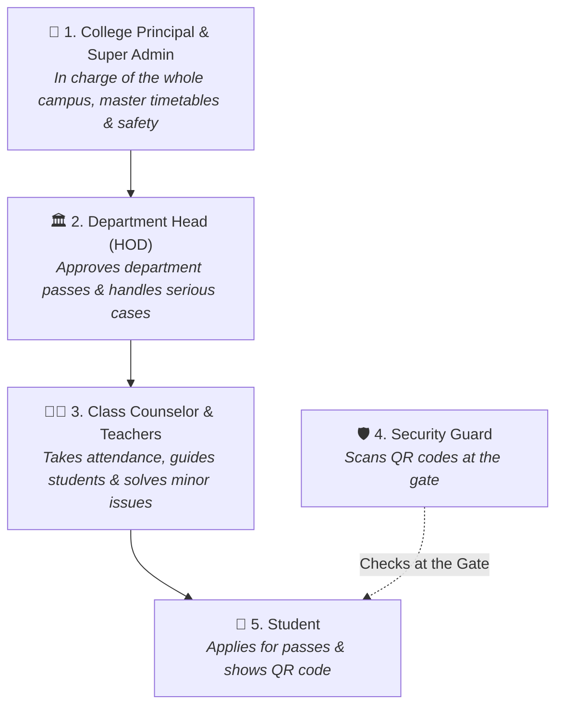
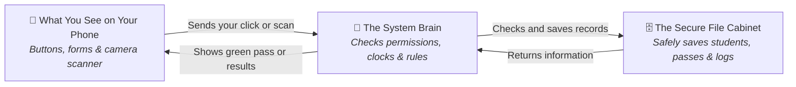
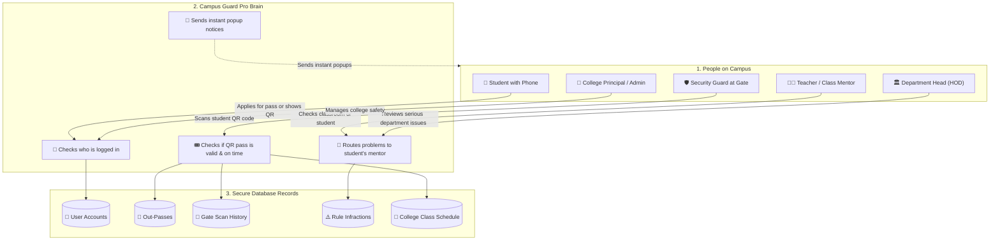
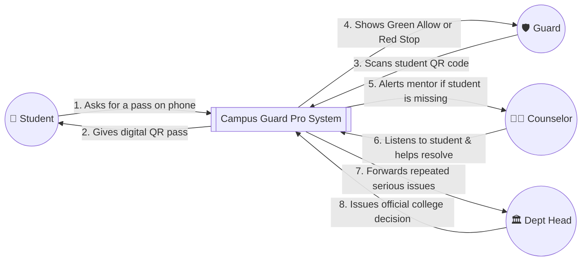
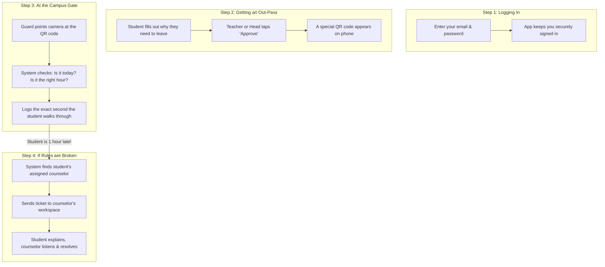
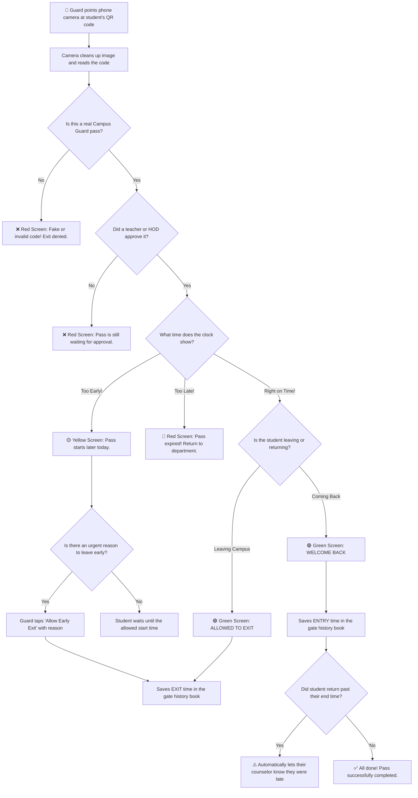
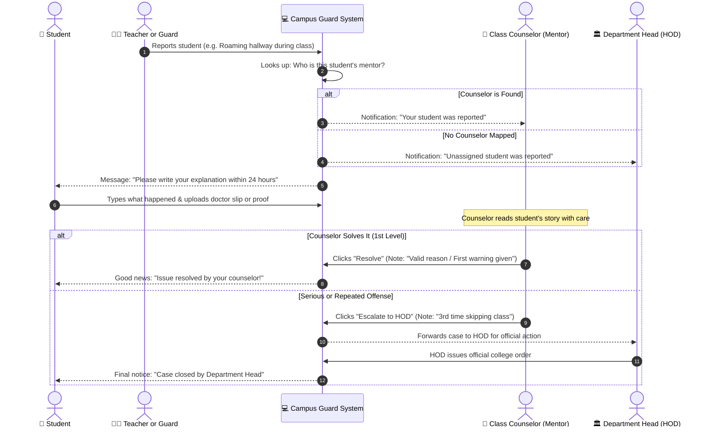
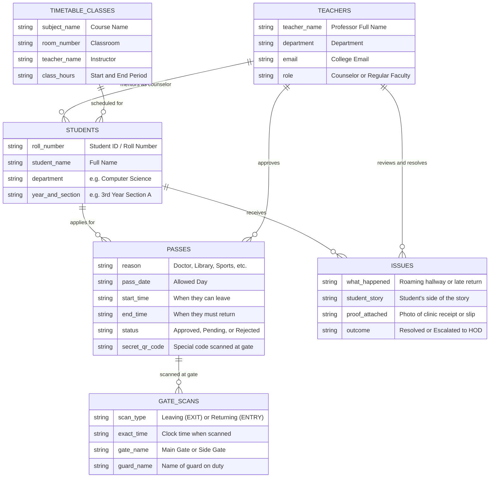

# 🛡️ Campus Guard Pro — Simple & Friendly Project Guide
### *A Smart College Gate Pass, Attendance & Campus Safety System*

---

> [!NOTE]
> **Who is this guide for?**  
> This guide is written in plain, everyday English. Whether you are a student, teacher, college principal, or software developer, this document explains **what Campus Guard Pro does, how it works, and why it makes campus life much easier and safer for everyone**.

---

## 📋 Table of Contents

1. [🌟 1. The Big Idea: What is Campus Guard Pro?](#-1-the-big-idea-what-is-campus-guard-pro)
2. [🛑 2. The Real Problems in Colleges Today (And How We Fix Them)](#-2-the-real-problems-in-colleges-today-and-how-we-fix-them)
3. [👥 3. The 5 Types of Users (Who Can Do What?)](#-3-the-5-types-of-users-who-can-do-what)
4. [🛠️ 4. What Tools Did We Use to Build It?](#️-4-what-tools-did-we-use-to-build-it)
5. [🔄 5. Visual Flowcharts & Diagrams (Explained in Plain English)](#-5-visual-flowcharts--diagrams-explained-in-plain-english)
   - [5.1 The Big Picture (How Everything Connects)](#51-the-big-picture-how-everything-connects)
   - [5.2 How Information Moves in the App](#52-how-information-moves-in-the-app)
   - [5.3 What Happens When a Guard Scans a Student's QR Code](#53-what-happens-when-a-guard-scans-a-students-qr-code)
   - [5.4 How Rule Violations are Handled (The "Counselor-First" Rule)](#54-how-rule-violations-are-handled-the-counselor-first-rule)
   - [5.5 How the Database Tables Connect Together](#55-how-the-database-tables-connect-together)
   - [5.6 The Complete Journey of a Gate Pass](#56-the-complete-journey-of-a-gate-pass)
6. [📱 6. A Tour of Every Screen in the App](#-6-a-tour-of-every-screen-in-the-app)
   - [6.1 The Login Screen](#61-the-login-screen)
   - [6.2 The Gate Security Scanner (For Guards)](#62-the-gate-security-scanner-for-guards)
   - [6.3 The Student Dashboard & Live QR Pass](#63-the-student-dashboard--live-qr-pass)
   - [6.4 The Counselor Workspace (For Mentors & Teachers)](#64-the-counselor-workspace-for-mentors--teachers)
   - [6.5 The Department Head (HOD) Control Room](#65-the-department-head-hod-control-room)
   - [6.6 Checking Attendance & Reporting Roaming Students](#66-checking-attendance--reporting-roaming-students)
7. [🗄️ 7. Database Tables (What We Store & Why)](#-7-database-tables-what-we-store--why)
8. [🎨 8. Look and Feel: Colors, Themes, and Big Buttons](#-8-look-and-feel-colors-themes-and-big-buttons)
9. [🔒 9. Security Made Simple (How We Keep Data Safe)](#-9-security-made-simple-how-we-keep-data-safe)
10. [🧪 10. How We Tested the System to Ensure Zero Bugs](#-10-how-we-tested-the-system-to-ensure-zero-bugs)
11. [🚀 11. How to Run This on Your Computer (Step-by-Step)](#-11-how-to-run-this-on-your-computer-step-by-step)
12. [🔮 12. Future Plans & Wrap-Up](#-12-future-plans--wrap-up)

---

## 🌟 1. The Big Idea: What is Campus Guard Pro?

Think about what usually happens when a college student needs to leave campus in the afternoon:

1. The student runs around searching for a teacher or department head to sign a paper gate pass.
2. The teacher might not be in their office, wasting 30 minutes.
3. Once signed, the student walks to the main gate.
4. The security guard manually writes the student's name, roll number, and departure time in a heavy paper logbook.
5. In the evening, when the student returns, the guard has to flip through pages to find the original entry.

**This old method has huge flaws:**
- Paper slips get lost, damaged, or even forged.
- Guards at busy gates get tired of writing and stop checking carefully.
- Teachers taking afternoon attendance have no clue if an absent student is sick, on official college duty, or simply skipping class.
- If a student sneaks out or returns hours late, nobody notices until days later.

**Campus Guard Pro fixes all of this with a simple phone app:**
- **Students ask for a pass online** in 10 seconds.
- **Teachers or Department Heads approve it** with one tap on their phone or laptop.
- **The student gets a clean QR code** on their phone screen.
- **Guards scan the QR code with their camera** in less than half a second.
- **If a student is missing without permission**, teachers can check the live schedule and report it.
- **Instead of punishing students right away**, the issue goes straight to the student's own **Class Counselor** first so they can talk, understand what happened, and solve it calmly.

---

## 🛑 2. The Real Problems in Colleges Today (And How We Fix Them)

Here is a quick look at the four biggest daily headaches in colleges and how Campus Guard Pro solves each one:

### Problem 1: Guards Can't Tell Who Has Real Permission
- **Before**: Students show handwritten notes or old paper slips. Guards can't verify signatures in the middle of a crowd.
- **Now**: Guards simply point their phone camera at the student's QR pass. The screen instantly turns **Green** (Allowed to Exit) or **Red** (Denied/Fake).

### Problem 2: Teachers Don't Know Why Students Are Missing
- **Before**: An instructor marks a student absent. They don't know if the student is in the library with permission, at a doctor's clinic, or roaming the hallways.
- **Now**: The system connects gate passes directly to the class schedule. Teachers can see right away if an absent student has an active approved out-pass.

### Problem 3: Department Heads (HODs) Get Swamped With Minor Issues
- **Before**: Every time a student comes back 10 minutes late, the paperwork lands on the Head of Department's desk, wasting valuable time.
- **Now**: The system uses a **Counselor-First** approach. Minor issues go to the student's class mentor first. Only serious, repeated offenses reach the Department Head.

### Problem 4: Students Don't Know Who Their Mentor Is
- **Before**: Many students don't even know which teacher is assigned as their personal academic advisor or counselor.
- **Now**: Every student's dashboard displays a friendly card showing their counselor's photo, name, office room, and email address.

---

## 👥 3. The 5 Types of Users (Who Can Do What?)

Different people have different jobs in a college. Campus Guard Pro gives each group their own tailored workspace:



### Quick Permissions Cheat-Sheet

| Action | Student | Guard | Teacher / Counselor | Dept Head (HOD) | Admin |
| :--- | :---: | :---: | :---: | :---: | :---: |
| **Apply for an out-pass** | ✅ Yes | ❌ No | ❌ No | ❌ No | ❌ No |
| **Show personal QR pass on phone** | ✅ Yes | ❌ No | ❌ No | ❌ No | ❌ No |
| **Scan QR codes at campus gates** | ❌ No | ✅ Yes | ❌ No | ❌ No | ❌ No |
| **Grant an early exit override** | ❌ No | ✅ Yes | ❌ No | ❌ No | ❌ No |
| **Check which class a student has now** | ❌ No | ✅ Yes | ✅ Yes | ✅ Yes | ✅ Yes |
| **View assigned student roster** | ❌ No | ❌ No | ✅ My Students | ✅ Entire Dept | ✅ All Students |
| **Approve or reject a pass** | ❌ No | ❌ No | ✅ My Students | ✅ Entire Dept | ✅ Any Pass |
| **Resolve a student violation report** | ❌ No | ❌ No | ✅ 1st Level | ✅ Final Level | ✅ Final Level |
| **Launch a campus emergency alert** | ❌ No | ✅ Yes | ❌ No | ❌ No | ✅ Yes |
| **Edit the master timetable** | ❌ No | ❌ No | ❌ No | ❌ No | ✅ Yes |
| **View system audit logs** | ❌ No | ❌ No | ❌ No | ❌ No | ✅ Yes |

---

## 🛠️ 4. What Tools Did We Use to Build It?

We built Campus Guard Pro with modern, reliable, and free open-source tools:



- **React 19 & Vite**: Makes the website load fast, feel snappy, and work smoothly like a native smartphone app.
- **Tailwind CSS v4**: Gives the app its clean dark-mode look, smooth buttons, and legible text.
- **jsQR**: A super-fast camera reader that scans QR codes in real time from mobile phone browsers.
- **TanStack Start**: The backend engine that connects our user screens directly to our server code safely.
- **PostgreSQL**: A rock-solid database that stores all user accounts, passes, gate logs, and class timetables.
- **Node.js Password Scrambling (`scrypt`)**: Protects passwords by mixing each one with random secret codes so they can never be stolen or guessed.

---

## 🔄 5. Visual Flowcharts & Diagrams (Explained in Plain English)

---

### 5.1 The Big Picture (How Everything Connects)

This diagram shows how everyone interacts with the system:



#### 🔍 In Plain English:
1. When **Students** request a pass, it goes through the server to the database.
2. When **Guards** scan a pass, the server instantly checks the time window and marks whether the student is leaving (`EXIT`) or returning (`ENTRY`).
3. When **Teachers** check an empty desk, the server checks the timetable database to see who should be there.
4. If a rule is broken, the server looks up the student's **Counselor** so the right mentor is notified.
5. Instant popups (notifications) tell users right away when their pass is approved or checked.

---

### 5.2 How Information Moves in the App

#### Simple Overview (Where Data Goes)



#### Step-by-Step Data Flow



#### 🔍 In Plain English:
- **Login**: You enter your email and password. The system checks our secure list and logs you in.
- **Pass Approval**: A student submits a reason. A teacher clicks approve. The system creates a secret, un-copyable QR code.
- **Gate Check**: The guard points their camera. The system checks the clock. If the student is allowed to leave, it records the exact second they stepped out.
- **Auto-Notice**: If the student returns an hour late, the system automatically creates a note for their mentor so they can check what caused the delay.

---

### 5.3 What Happens When a Guard Scans a Student's QR Code

Here is the exact thought process the computer follows in less than 500 milliseconds:



#### 🔍 In Plain English:
- **🟢 Green Screen**: Everything is valid. The student is authorized to pass.
- **🟡 Yellow Screen**: The pass is approved, but the student arrived early (for example, their pass starts at 3:00 PM, but it's only 1:45 PM). If there is an urgent reason, the guard can tap **"Allow Early Exit"**, which logs their officer ID and reason.
- **🔴 Red Screen**: The pass is expired, rejected, canceled, or fake. The guard denies exit.
- **Two Scans with One Pass**: A pass works twice—once when leaving campus and once when coming back.

---

### 5.4 How Rule Violations are Handled (The "Counselor-First" Rule)

In many colleges, students caught roaming or coming back late are immediately dragged to the Principal or Department Head. Campus Guard Pro introduces a much fairer and friendlier workflow:



#### 🔍 In Plain English:
1. **The Student Gets a Voice**: The student has 24 hours to explain why they were late or out of class and can upload photos of receipts, medical notes, or club slips.
2. **Mentorship First**: The class mentor reads the explanation first. If the student had a flat tire or a clinic visit, the counselor can resolve it right away without dragging them into a scary disciplinary hearing.
3. **Escalate Only When Necessary**: If the student is caught repeatedly cutting class or causing trouble, the counselor forwards the case to the Department Head with their notes.

---

### 5.5 How the Database Tables Connect Together

Here is a clear picture of how information is organized in our database:



#### 🔍 In Plain English:
- **STUDENTS**: Information about every student in the college.
- **PASSES**: Saves every pass request, the reason, and allowed hours.
- **GATE_SCANS**: Permanent record of every gate scan made by security guards.
- **TEACHERS**: List of faculty members and mentors.
- **ISSUES**: Tracks any disciplinary tickets and how mentors resolved them.
- **TIMETABLE_CLASSES**: The 642 master class periods across all departments.

---

### 5.6 The Complete Journey of a Gate Pass

Here is the life story of a pass from the moment a student submits it until they come back to campus:

```mermaid
stateDiagram-v8
    [*] --> FormSubmitted : Student fills out the pass form
    FormSubmitted --> WaitingForReview : Sent to teacher or HOD
    WaitingForReview --> Denied : Teacher or HOD says No
    WaitingForReview --> Approved : Teacher or HOD says Yes
    
    state Approved {
        [*] --> TooEarly : Before allowed start time
        TooEarly --> ReadyToLeave : Allowed start hour arrives
        TooEarly --> EarlyExitGranted : Guard grants early exit
        
        ReadyToLeave --> OutsideCampus : Guard scans EXIT at gate
        EarlyExitGranted --> OutsideCampus : Guard scans EXIT with override
        
        OutsideCampus --> BackOnTime : Guard scans ENTRY on time
        OutsideCampus --> BackLate : Guard scans ENTRY past end hour
    }
    
    BackOnTime --> PassFinished : Done! Student is back safely
    BackLate --> NotifiedCounselor : System flags late return for mentor
    
    NotifiedCounselor --> [*]
    PassFinished --> [*]
    Denied --> [*]
```

---

## 📱 6. A Tour of Every Screen in the App

---

### 6.1 The Login Screen
- **Address in app**: `/auth`
- **What it does**: Anyone can sign in with their college email and password.
- **Helpful Feature**: We built clickable role badges on the login page (**Student**, **Faculty**, **Security**, **HOD**, **Admin**). Clicking any badge instantly fills in demo credentials so reviewers can test the app without typing!
- **Forgot Password**: If you forget your password, there is an easy 3-step screen at `/reset-password` that lets you reset it with a verification code.

---

### 6.2 The Gate Security Scanner (For Guards)
- **Address in app**: `/security/check`
- **What it does**: Turns any basic smartphone camera into an ultra-fast gate scanner.
- **Key Features**:
  - **Screen Glare Filter**: Guards can scan student phone screens even under intense midday sun.
  - **Color Coded Status Cards**:
    - 🟢 **Green**: Allowed to Exit or Allowed to Enter. Shows the student's photo, name, and roll number.
    - 🟡 **Yellow**: Too early! Shows a live countdown to the pass start time, plus an **"Allow Early Exit"** button if the student has a valid reason.
    - 🔴 **Red**: Denied! Pass is expired, canceled, or fake.
  - **Big Buttons**: All touch targets are at least 44 pixels tall so guards can tap them easily with one thumb.

---

### 6.3 The Student Dashboard & Live QR Pass
- **Address in app**: `/student/dashboard` and `/student/passes`
- **What it does**: The student's everyday home screen.
- **Key Features**:
  - **Request a Pass**: Pick a reason (Doctor, Library, Sports, Lab work), choose the hours, and submit.
  - **Live Digital QR**: Shows an active QR code with a live countdown timer.
  - **My Counselor Card**: Displays the assigned mentor's photo, name, department, and contact email so the student always knows who to go to for help.
  - **Submit Explanation**: If reported for being out of class, students can type their explanation and attach photos or clinic receipts at `/student/explanations`.

---

### 6.4 The Counselor Workspace (For Mentors & Teachers)
- **Address in app**: `/faculty/counselor`
- **What it does**: A dedicated space for teachers who mentor a cohort of students.
- **Key Features**:
  - **My Assigned Students**: A searchable list of all students assigned to this counselor. Filterable by Year, Section, and Department.
  - **Pass Approvals**: One-click approval for out-pass requests submitted by assigned students.
  - **Violation Cases**: Review students who returned late or were reported in hallways. Read their explanation, see attached proof, and click **"Resolve"** or **"Escalate to HOD"**.

---

### 6.5 The Department Head (HOD) Control Room
- **Address in app**: `/hod/dashboard` and `/hod/cases`
- **What it does**: High-level departmental oversight.
- **Key Features**:
  - **Pass Queue**: Approve passes for any student in the department.
  - **Departmental Isolation**: A CSE HOD can only see CSE students. An ECE HOD can only see ECE students. This keeps sensitive student records private.
  - **Escalated Cases**: Handle serious disciplinary cases referred by counselors.

---

### 6.6 Checking Attendance & Reporting Roaming Students
- **Address in app**: `/faculty/check`
- **What it does**: Allows teachers to check student schedules.
- **Key Features**:
  - **Instant Timetable Lookup**: Type a student's roll number. The system checks the 642 master class slots and instantly tells you: *"Ashok Dora should currently be in Room C-204 for Data Structures with Dr. Sharma."*
  - **Report Loitering**: If the student is found wandering outside instead of sitting in class, the teacher can submit a quick report.
  - **Anti-Spam Filter**: If two teachers try to report the same student within 15 minutes, the system ignores the duplicate so students aren't unfairly penalized twice.

---

## 🗄️ 7. Database Tables (What We Store & Why)

All records are stored securely in **PostgreSQL**. Here is what each table does in simple words:

| Table Name | What It Stores | Why It Matters |
| :--- | :--- | :--- |
| **`profiles`** | Names, emails, scrambled passwords, and departments. | Allows everyone to log in securely. |
| **`user_roles`** | Tells the system if someone is a student, guard, teacher, HOD, or admin. | Makes sure students can't view admin screens. |
| **`students`** | Master list of students, roll numbers, years, sections, and photos. | Holds official college student records. |
| **`movement_permissions`** | Pass requests, approved hours, reasons, and secret QR code strings. | Tracks every out-pass in the college. |
| **`movement_logs`** | The exact timestamp of every gate scan (Exit or Entry) and guard ID. | Proves who entered or left campus and at what second. |
| **`counselor_assignments`** | Maps which teacher mentors which student. | Enables the Counselor-First system. |
| **`violation_reports`** | Disciplinary reports, student explanations, and resolution notes. | Tracks student rule infractions and outcomes. |
| **`class_slots`** | All 642 timetable classes across all departments and semesters. | Lets the app check who belongs in which classroom right now. |
| **`emergency_incidents`** | Campus emergency alerts (medical, fire, hazard) and response notes. | Coordinates safety teams during crisis events. |
| **`audit_logs`** | An unchangeable history book of every important action in the system. | 100% transparency for college administration. |

---

## 🎨 8. Look and Feel: Colors, Themes, and Big Buttons

We specifically designed Campus Guard Pro for real-world college environments:

- **Deep Space Dark Theme**: Reduces battery usage and eye strain for guards and teachers on long shifts.
- **Clear, Unmistakable Colors**:
  - 🟢 **Emerald Green**: Everything is safe and approved (Allowed to Exit / Pass Verified).
  - 🟡 **Amber Gold**: Caution or pending item (Pass starts in 30 minutes / Early Exit).
  - 🔴 **Crimson Red**: Denied, fake, expired, or emergency!
  - 🔵 **Royal Blue**: Clickable buttons and links.
- **Large Touch Targets**: Buttons for guards are at least 44 pixels tall so they are effortless to tap on a phone screen without misclicking.

---

## 🔒 9. Security Made Simple (How We Keep Data Safe)

You don't need a degree in cybersecurity to understand how we protect student data:

1. **Passwords are Scrambled**: We never save actual passwords. Each password is mixed with a secret random code (called a salt) and scrambled using Node.js `scrypt`. Even if a hacker stole the database file, they could never read anyone's password.
2. **Un-Guessable QR Codes**: The QR code on a student's phone doesn't contain their student ID or personal information. It contains a random secret string. Nobody can guess or fake someone else's pass.
3. **No Direct Database Access from Browsers**: All database queries run safely on the server. Hackers cannot send sneaky commands through input boxes (SQL Injection Defense).
4. **Guards Against Password Guessers**: If someone tries guessing a password 5 times in 15 minutes, their login is temporarily locked.
5. **Private Department Boundaries**: A CSE HOD can only see CSE student records. They cannot snoop on Mechanical or Civil Engineering students.

---

## 🧪 10. How We Tested the System to Ensure Zero Bugs

Before releasing this system, we performed over **700 automated verification checks**:

- ✅ **Timetable Integrity (642/642 Passed)**: Verified that all 642 class periods load without schedule conflicts.
- ✅ **Pass Dual-Scan Check (17/17 Passed)**: Confirmed that a pass can be scanned at the gate to leave (`EXIT`) and then scanned again to return (`ENTRY`) without breaking.
- ✅ **Counselor Assignment Check (8/8 Passed)**: Confirmed that student violation tickets route to their assigned mentor and that counselors only see their own cohort.
- ✅ **Early Exit Override Check**: Confirmed that guards can properly grant early exit with an audit trail when a student has a legitimate emergency.
- ✅ **Type Safety Check**: Ran `npx tsc --noEmit` and got **0 errors** across the entire codebase.

---

## 🚀 11. How to Run This on Your Computer (Step-by-Step)

Want to try Campus Guard Pro on your laptop? Here is the easiest way:

### Requirements
- **Node.js** (version 20 or newer)
- **PostgreSQL** (version 14 or newer) OR **Docker**

---

### Option A: Using Docker (Recommended — Just 1 Command)
If you have Docker Desktop installed, open your terminal in the project folder and run:
```bash
docker compose up -d
```
That's it!
- The web app is live at: `http://localhost:3000`
- The database viewer (pgAdmin) is live at: `http://localhost:5051`

---

### Option B: Running with Node.js
If you prefer running without Docker:

```bash
# 1. Open the project folder
cd "Campus guard pro"

# 2. Install dependencies
npm install

# 3. Copy the environment file
cp .env.example .env

# 4. Start the app in development mode
npm run dev
```

Open your browser and navigate to: **`http://localhost:8081`**

---

### Demo Accounts for Testing

| Role | Email | Password |
| :--- | :--- | :--- |
| **Student** | `student@cmadms.edu` | `Password123!` |
| **Teacher / Counselor** | `faculty@cmadms.edu` | `Password123!` |
| **Security Guard** | `security@cmadms.edu` | `Password123!` |
| **Department Head (HOD)** | `hod.cse@cmadms.edu` | `Password123!` |
| **Super Admin** | `admin@cmadms.edu` | `Password123!` |

*(Pro-Tip: On the login screen, you can just click any of the colored role badges to auto-fill these accounts instantly!)*

---

## 🔮 12. Future Plans & Wrap-Up

### What We Are Planning Next
- 📱 **Offline Mode for Gates**: Enabling guards to scan passes even if the campus internet goes down for a few minutes.
- 🤖 **Crowd Prediction**: Alerting security guards before peak gate rush hours (like Friday afternoons) so they can open extra lanes.
- 💬 **SMS & WhatsApp Alerts**: Sending automatic text messages to parents when a student leaves campus for emergency medical visits.

### Final Thoughts
**Campus Guard Pro (CMADMS)** replaces slow paper slips, messy gate logbooks, and chaotic attendance checks with a fast, modern, and human-friendly digital system.

By putting class counselors in the driver's seat and giving security guards instant QR scanning tools, Campus Guard Pro makes college campuses safer, calmer, and much better organized for everyone.

---

<div align="center">
  <sub>Campus Guard Pro (CMADMS) — Built with care for safer, smarter college campuses.</sub>
</div>
