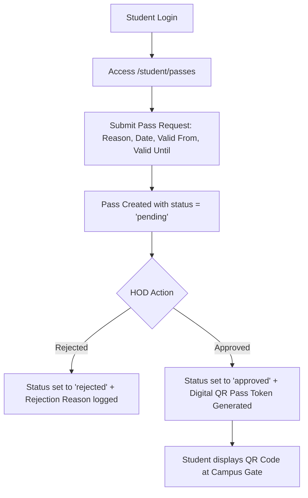
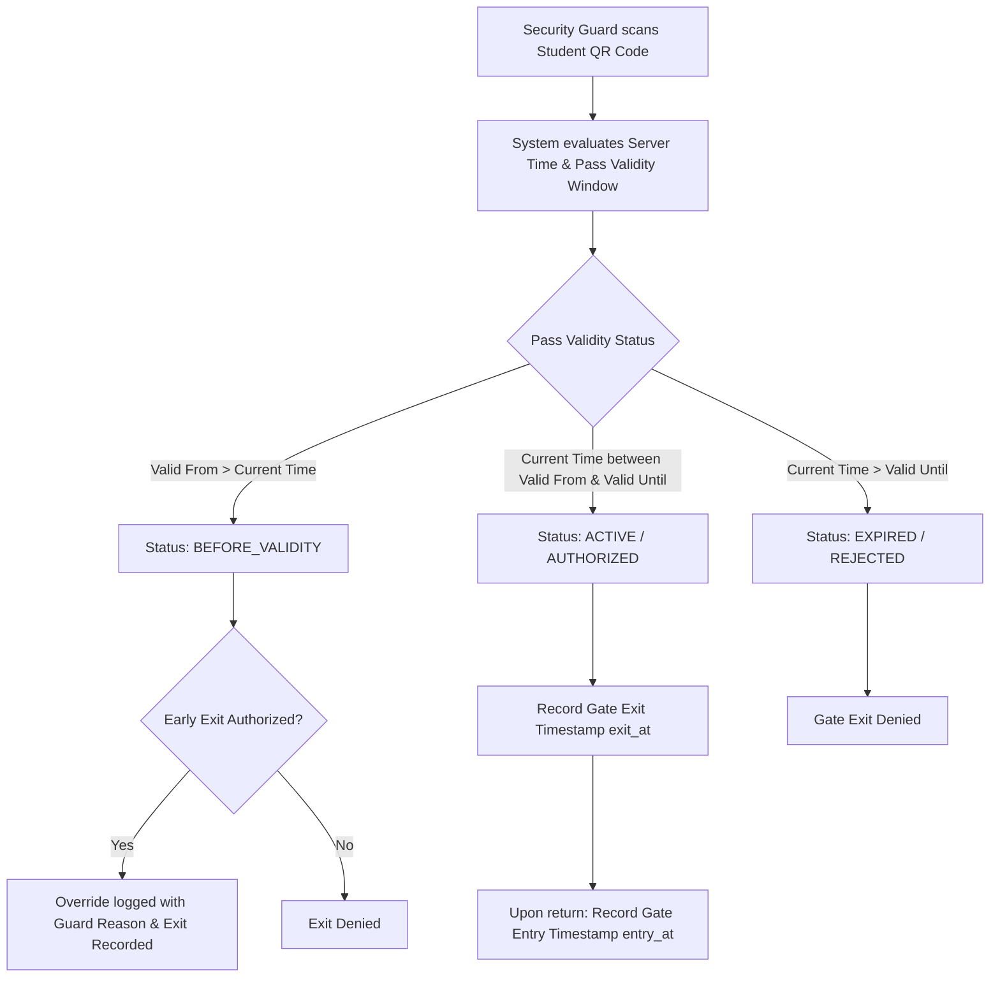
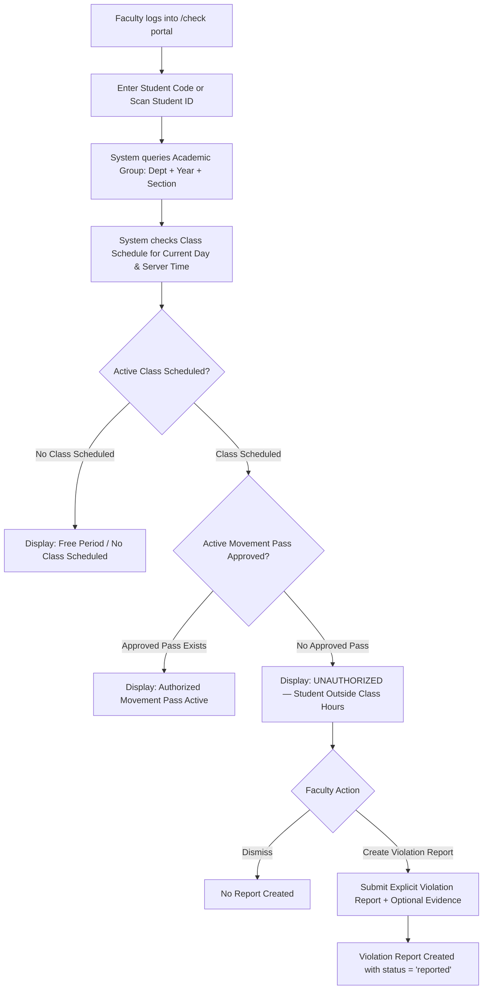
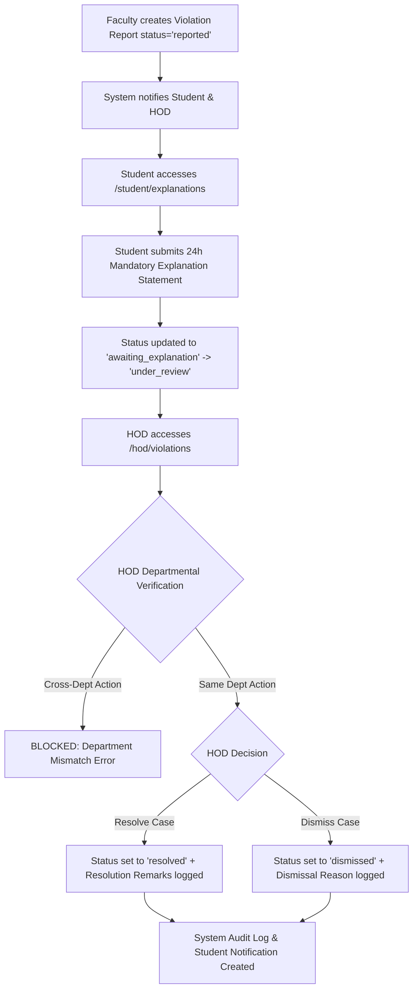
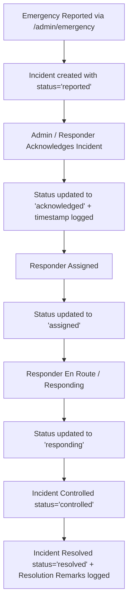

# CMADMS — Complete End-to-End Workflows

This document details the exact operational workflows implemented in CMADMS, matching the verified source code implementation.

---

## 1. Student Movement Pass Workflow

---

## 2. Security Gate Verification Workflow

---

## 3. Faculty Verification & Attendance Workflow (`/check`)

---

## 4. Violation & Investigation Lifecycle Workflow

---

## 5. Emergency Incident Response Workflow

