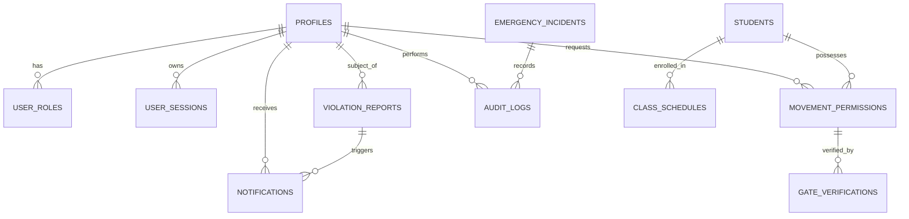

# CMADMS — Database Design & Schema Documentation

## Database Overview
CMADMS uses a relational **PostgreSQL** database managed via `node-postgres` (`pg` Pool). The schema contains 14 core operational tables storing institutional profiles, role assignments, user sessions, academic groups, class schedules, movement permissions, gate verification records, violation reports, emergency incidents, notifications, and immutable audit logs.

---

## Mermaid Entity-Relationship (ER) Diagram

---

## Table Specifications

### 1. `profiles`
- **Purpose**: Stores core user identity and account details.
- **Primary Key**: `id` (UUID)
- **Columns**: `id`, `full_name`, `email`, `department`, `staff_code`, `student_code`, `password_hash`, `assigned_post`, `created_at`, `updated_at`

### 2. `user_roles`
- **Purpose**: Maps users to institutional roles (`student`, `faculty`, `security`, `hod`, `admin`).
- **Primary Key**: Composite (`user_id`, `role`)
- **Foreign Key**: `user_id` $\rightarrow$ `profiles.id`

### 3. `user_sessions`
- **Purpose**: Stores server-side sessions for authenticated users issuing HttpOnly cookies.
- **Primary Key**: `session_id` (Text)
- **Foreign Key**: `user_id` $\rightarrow$ `profiles.id`
- **Columns**: `session_id`, `user_id`, `role`, `email`, `department`, `staff_code`, `student_code`, `full_name`, `assigned_post`, `expires_at`, `created_at`

### 4. `students`
- **Purpose**: Academic student directory containing roll numbers and class assignments.
- **Primary Key**: `student_code` (Text, e.g. `23CSE1012`)
- **Columns**: `student_code`, `name`, `department`, `year`, `section`, `semester`, `status`, `created_at`

### 5. `movement_permissions`
- **Purpose**: Stores student digital movement pass requests and approval status.
- **Primary Key**: `id` (UUID)
- **Foreign Key**: `student_code` $\rightarrow$ `students.student_code`
- **Columns**: `id`, `student_code`, `reason`, `date`, `valid_from`, `valid_until`, `status` (`pending`, `approved`, `rejected`), `issued_by`, `rejection_reason`, `exit_at`, `entry_at`, `created_at`

### 6. `gate_verifications`
- **Purpose**: Real-time gate scan verification logs recorded by security guards.
- **Primary Key**: `id` (UUID)
- **Foreign Keys**: `pass_id` $\rightarrow$ `movement_permissions.id`, `scanned_by` $\rightarrow$ `profiles.id`
- **Columns**: `id`, `pass_id`, `student_code`, `scanned_by`, `verification_status`, `early_exit_override`, `early_exit_reason`, `scanned_at`

### 7. `class_schedules`
- **Purpose**: Contains the 642 deterministic weekly timetable slots linking academic groups, rooms, subjects, and faculty.
- **Primary Key**: `id` (UUID / Serial)
- **Columns**: `id`, `student_code`, `staff_code`, `faculty_name`, `subject_code`, `subject`, `start_time`, `end_time`, `room`, `day_of_week`, `batch`, `department`, `year`, `section`

### 8. `violation_reports`
- **Purpose**: Tracks student movement violations, 24h explanations, and HOD investigations.
- **Primary Key**: `id` (Text, e.g. `RPT-890453`)
- **Columns**: `id`, `student_code`, `student_name`, `department`, `year_section`, `class_name`, `scheduled_time`, `room`, `incident_time`, `location`, `remarks`, `reported_by`, `status` (`reported`, `awaiting_explanation`, `under_review`, `resolved`, `dismissed`), `explanation`, `explanation_submitted_at`, `explanation_deadline`, `investigation_notes`, `resolved_by`, `resolved_at`, `resolution_type`, `created_at`

### 9. `emergency_incidents`
- **Purpose**: Manages campus safety emergencies and incident response dispatch.
- **Primary Key**: `id` (Text, e.g. `EMG-1092`)
- **Columns**: `id`, `report_type`, `location`, `description`, `reported_by`, `status` (`reported`, `acknowledged`, `assigned`, `responding`, `controlled`, `resolved`), `severity`, `acknowledged_at`, `acknowledged_by`, `responder_assigned`, `assigned_at`, `responding_at`, `controlled_at`, `resolved_at`, `resolution_remarks`, `created_at`

### 10. `notifications`
- **Purpose**: User-specific notification feed for system events and alerts.
- **Primary Key**: `id` (UUID)
- **Columns**: `id`, `recipient_id`, `recipient_role`, `title`, `message`, `type`, `is_read`, `created_at`

### 11. `audit_logs`
- **Purpose**: Immutable security audit trail recording system lifecycle actions.
- **Primary Key**: `id` (UUID)
- **Columns**: `id`, `actor_id`, `actor_name`, `actor_role`, `action`, `resource`, `details`, `ip_address`, `created_at`

### 12. `departments`, `courses`, `rooms`
- **Purpose**: Master institutional metadata records for departments, academic courses, and campus rooms/buildings.
