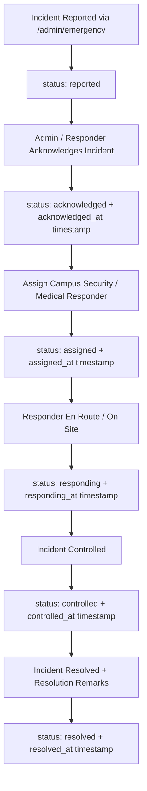

# CMADMS — Emergency Response Architecture

## Overview
The Emergency Response System provides real-time reporting, dispatch, responder tracking, and incident resolution for campus safety incidents (e.g. physical altercations, medical emergencies, fire hazards).

---

## Emergency Incident Lifecycle

---

## Response Metric Tracking
For every emergency incident, the system records milestone timestamps in `emergency_incidents`:
- **Response Time**: `acknowledged_at - created_at`
- **Dispatch Time**: `assigned_at - acknowledged_at`
- **Containment Time**: `controlled_at - responding_at`
- **Total Resolution Duration**: `resolved_at - created_at`

All emergency state transitions generate high-priority notifications and immutable audit log entries.
