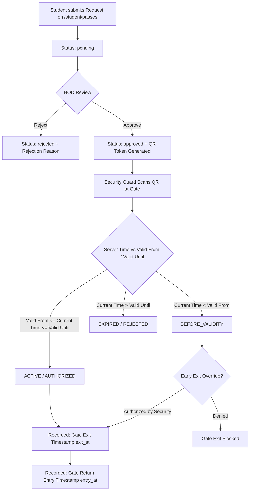

# CMADMS — Movement Pass System Architecture

## Overview
The Movement Pass System manages digital movement permission requests, HOD authorization workflows, QR code pass generation, real-time gate time verification, and early exit overrides.

---

## Pass Lifecycle & State Engine

---

## Key Operational Rules

1. **Digital QR Code Tokens**:
   - Approved passes generate a signed digital QR code token containing pass UUID, student code, valid window, and issue signature.

2. **Time Validity Evaluation**:
   - **`BEFORE_VALIDITY`**: Attempting to exit prior to `valid_from` start time.
   - **`ACTIVE`**: Current time is within `valid_from` and `valid_until`.
   - **`EXPIRED`**: Exceeds `valid_until` timestamp.

3. **Early Exit Override Mechanics**:
   - Guards can authorize an **Early Exit** for urgent student departures prior to `valid_from`.
   - Authorizing an Early Exit logs `early_exit_override = true` and the guard's reason in `gate_verifications` without altering the original pass validity parameters.
