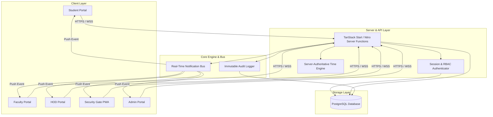

# CMADMS / CampusGuard Pro — System Architecture & Layer Breakdown

---

## 1. HIGH-LEVEL SYSTEM ARCHITECTURE

The CMADMS architecture follows a secure, decoupled multi-tier design pattern. The presentation layer (React + PWA) interacts with the Nitro server runtime via type-safe server functions (`createServerFn`), which interact with the PostgreSQL storage engine, audit logger, and real-time event bus.



---

## 2. LAYER RESPONSIBILITY BREAKDOWN

### 2.1 Frontend Client Layer (React 18 + PWA)
- **Role**: Presents role-tailored user interfaces for Students, Faculty, HODs, Security, and Admins.
- **Responsibilities**:
  - Manages client-side UI states, form validations (Zod), and touch interactions.
  - Subscribes to real-time notification events.
  - Operates the Security Gate camera scanner (`jsQR`) for instant QR pass verification.
  - Registers Service Worker (`public/sw.js`) for PWA installation and offline connection monitoring.

### 2.2 Server & API Layer (TanStack Start + Nitro Runtime)
- **Role**: Executes server-side business logic, authentication, and security validation.
- **Responsibilities**:
  - Enforces server-side Role-Based Access Control (`requireRole`).
  - Verifies passwords using `scrypt` hashing with 16-byte random salts.
  - Evaluates movement pass validity using server-authoritative timestamps (`CURRENT_DATE` and `CURRENT_TIME`).
  - Sanitizes sensitive user information before returning responses to clients.

### 2.3 Database Storage Layer (PostgreSQL)
- **Role**: Primary institutional source of truth.
- **Responsibilities**:
  - Maintains master tables: `users`, `profiles`, `students`, `faculty`, `departments`, `class_schedules`, `movement_permissions`, `violation_reports`, `emergency_incidents`, `notifications`, `audit_logs`, and `user_sessions`.
  - Executes ACID-compliant atomic transactions (`BEGIN`, `COMMIT`, `ROLLBACK`) for pass approvals, case resolutions, and emergency updates.
  - Enforces relational foreign key integrity and indexing on high-frequency search columns (`student_code`, `department`, `status`).

### 2.4 Real-Time Notification Bus
- **Role**: Dispatches event notifications to online clients.
- **Responsibilities**:
  - Emits event broadcasts when movement passes are updated, violations are reported, or emergency incidents are created.
  - Filters broadcast delivery by recipient user ID, role, or department.
  - Interoperates with PostgreSQL: Notifications are persisted to the database *before* broadcasting.

### 2.5 Immutable Audit Logger
- **Role**: Tracks all security-critical lifecycle events across the campus.
- **Responsibilities**:
  - Records immutable log entries in `audit_logs` table for pass creations, HOD approvals, security gate checks, violation filings, HOD resolutions, and emergency dispatches.
  - Captures actor identity, role, timestamp, action name, target ID, and JSON metadata.

### 2.6 Security Gate PWA Engine
- **Role**: Specialized mobile verification client for security officers.
- **Responsibilities**:
  - Runs in standalone mobile view (`display: standalone`).
  - Detects network connectivity (`navigator.onLine`) and displays a prominent warning banner during offline outages.
  - **Security Rule**: Explicitly bypasses `/api` routes from Service Worker cache to guarantee zero offline caching of student pass validity states.

---

## 3. DEPARTMENTAL ISOLATION ARCHITECTURE

CMADMS strictly enforces department-level isolation in database queries to ensure HODs can only access data belonging to their academic department.

```
HOD Session (Department: CSE)
       │
       ▼
Query: SELECT * FROM violation_reports 
       WHERE UPPER(department) = UPPER('CSE');
       │
       ├─► Returns CSE Violation Cases (Authorized)
       └─► Excludes ECE, MECH, CIVIL Cases (Blocked by SQL)
```

This query structure guarantees zero cross-departmental data leakage across HOD dashboards.
