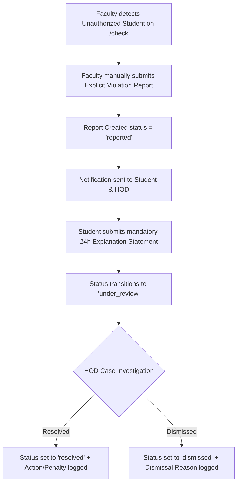

# CMADMS — Violation Management Architecture

## Overview
Violation management in CMADMS handles unauthorized student movements, faculty reporting, mandatory student 24-hour explanations, HOD departmental investigations, and case resolution.

---

## Violation Case Lifecycle

---

## Key Design & Policy Principles

### 1. Explicit Faculty Reporting
- Detection of an unauthorized student on `/check` does **NOT** automatically log a violation report.
- Faculty members evaluate situational context (e.g. medical emergency, faculty note) and must make an explicit decision to create a report.

### 2. Mandatory 24-Hour Student Explanation Window
- When a report is created, an `explanation_deadline` is set to `created_at + 24 hours`.
- Students view flagged reports in `/student/explanations` and submit their written explanation statement within the 24-hour window.

### 3. HOD Departmental Authority & Isolation
- Violation reports land in the HOD departmental queue (`/hod/violations`).
- HODs investigate cases using student schedule data, gate verification logs, and student explanations.
- Cross-department resolution is strictly blocked server-side by HOD department validation.
