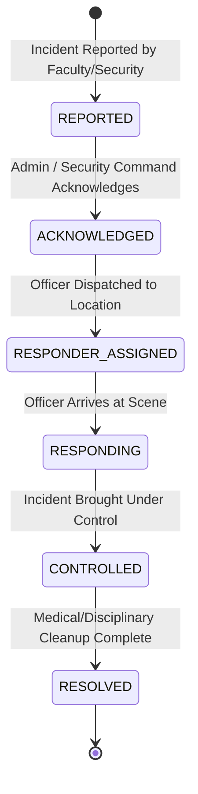

# CMADMS / CampusGuard Pro — Complete Workflows & State Machines

---

## 1. END-TO-END ROLE WORKFLOWS

### 1.1 Student Workflow
```
[Student Login]
       │
       ▼
[Dashboard] ──► View active passes & notifications
       │
       ▼
[Apply Movement Pass] ──► Select Reason, Date, Valid From, Valid Until
       │
       ▼
[HOD Queue] ──► Status: pending
       │
       ▼
[HOD Approval] ──► Status: approved (Pass Token & Digital QR generated)
       │
       ▼
[Digital QR Pass] ──► Present at campus gate
       │
       ▼
[Security Verification] ──► Scanned / Checked by Officer
       │
       ▼
[Gate Exit] ──► exit_at timestamp logged in DB
       │
       ▼
[Gate Entry] ──► entry_at timestamp logged in DB ──► Pass Status: COMPLETED
```

**Student Violation Explanation Sub-Workflow**:
When a violation report is filed for a student:
1. Student receives real-time notification: *"Violation Report Filed. Please submit explanation within 24 hours."*
2. Student opens `/student/explanations`, views case details, enters written explanation, and attaches medical/documentary evidence.
3. System updates status to `explanation_submitted` and notifies Department HOD.

---

### 1.2 Faculty Workflow
```
[Faculty Login]
       │
       ▼
[Student Lookup] ──► Input Roll No or QR Token Code
       │
       ▼
[Timetable Resolution] ──► Auto-resolves Department + Year + Section + Schedule
       │
       ▼
[Physical Status Check]
       │
       ├─► Student Has Active Approved Movement Pass ──► Authorized Movement (No Violation)
       │
       └─► Student Absent Without Pass ──► Unauthorized Class Movement Detected
              │
              ▼
       [Submit Violation Report] ──► Select Incident Time, Location, Severity, Remarks
              │
              ▼
       [Report Created] ──► Duplicate throttled (15 min) ──► Routed to HOD DB Queue
```

---

### 1.3 HOD Workflow (Final Departmental Authority)
```
[HOD Login] ──► Filtered strictly by HOD's Department
       │
       ▼
[Department Queue] ──► View active movement passes & violation reports
       │
       ├─► Movement Passes: Click Approve or Reject
       │
       └─► Violation Cases: Select Case to Investigate
              │
              ▼
       [Start Review] ──► Status: under_review (Notifies Faculty & Student)
              │
              ▼
       [Review Student Explanation & Evidence]
              │
              ├─► Case Valid / Student Apology Accepted ──► Resolve Case (Mandatory Remarks)
              │                                                │
              │                                                ▼
              │                                           Status: RESOLVED
              │
              ├─► False Report / Exoneration ───────────► Dismiss Case (Mandatory Remarks)
              │                                                │
              │                                                ▼
              │                                           Status: DISMISSED
              │
              └─► High-Severity / Violence Incident ─────► Escalate to Admin
                                                               │
                                                               ▼
                                                          Status: ESCALATED
```

---

### 1.4 Security Gate Workflow (PWA Portal)
```
[Security Officer Login] ──► Select Gate Checkpoint (e.g., Main Gate)
       │
       ▼
[Scan QR / Enter Roll No]
       │
       ▼
[Server-Authoritative Time Check]
       │
       ├─► BEFORE VALIDITY (Current time < valid_from)
       │      │
       │      ├─► Display Golden Warning Card + Time Remaining
       │      └─► Provide [ ALLOW EARLY EXIT ] Button ──► Requires Officer Confirmation
       │
       ├─► ACTIVE (valid_from <= Current time <= valid_until)
       │      │
       │      ├─► Outbound (exit_at IS NULL) ──► Grant Exit ──► Log exit_at timestamp
       │      └─► Inbound (exit_at EXISTS, entry_at IS NULL) ──► Grant Entry ──► Log entry_at
       │
       └─► EXPIRED (Current time > valid_until OR Date < Today)
              │
              └─► Display Red Warning ──► BLOCK GATE EXIT
```

---

### 1.5 Admin Workflow
```
[Admin Login]
       │
       ▼
[Institutional Oversight]
       ├──► Manage Users (Students, Faculty, HODs, Security)
       ├──► Manage Academic Infrastructure (Departments, Rooms, Courses)
       ├──► Manage Master Class Schedules (642 Timetable Slots)
       ├──► Monitor Campus Violation Trends & Audit Logs
       └──► Operate Emergency Command Center
```

---

## 2. EMERGENCY INCIDENT COMMAND SYSTEM (6-STAGE WORKFLOW)

CMADMS includes a 6-stage campus emergency incident response workflow to handle critical safety events (medical emergencies, physical altercations, safety hazards):



### Stage Breakdown & Action Rules

| Stage | Status Key | Action Trigger | Authorized Actor | Audit Log Action |
| :--- | :--- | :--- | :--- | :--- |
| **1. Reported** | `reported` | Incident created via violation or emergency reporting. | Faculty / Security | `emergency_incident_created` |
| **2. Acknowledged** | `acknowledged` | Command center acknowledges receipt of alert. | Admin / Security | `emergency_incident_acknowledged` |
| **3. Responder Assigned** | `responder_assigned` | Specific security officer assigned to dispatch location. | Admin / Security | `emergency_responder_assigned` |
| **4. Responding** | `responding` | Assigned responder confirms arrival at physical location. | Assigned Security | `emergency_response_started` |
| **5. Controlled** | `controlled` | Officer brings physical situation under control. | Assigned Security | `emergency_incident_controlled` |
| **6. Resolved** | `resolved` | Incident fully closed with mandatory resolution remarks. | Admin / HOD | `emergency_incident_resolved` |

**State Machine Enforcements**:
- Direct transition from `reported` $\rightarrow$ `resolved` is blocked; incidents must progress through active response stages.
- Resolution remarks (minimum 5 characters) are mandatory to execute the `resolved` transition.
- All status updates generate atomic audit log records and dispatch real-time alerts to Admins, HODs, and Security teams.
